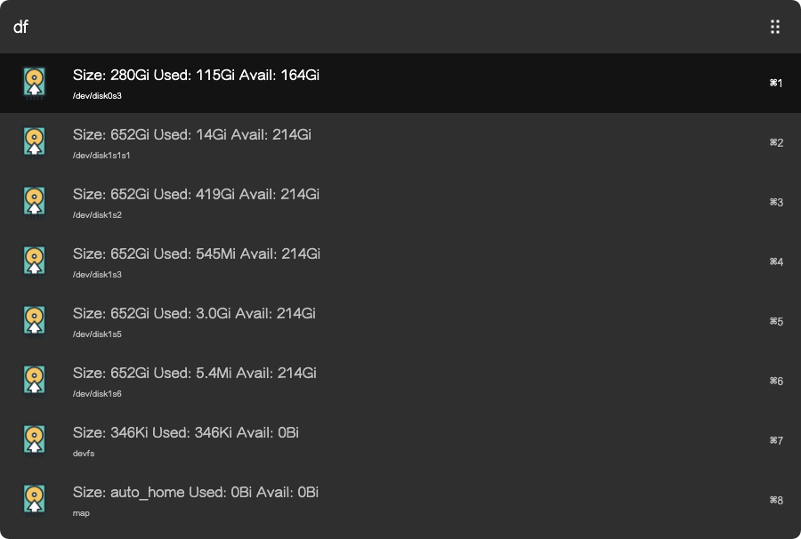

# arvis-diskusage

> Show disk usage in Arvis



## Install

```
$ npm install --global arvis-diskusage
```


## Usage

In arvis, type `df`, <kbd>Enter</kbd>, and you'll see you mac disk usage info.


## License

MIT © [lcc19941214](http://achuan.me)

## 🔗 This workflow is converted from [alfred-workflow](https://github.com/lcc19941214/alfred-diskusage).

* Note that there might be some code change or different actions from the original workflow.

* Marked original workflow's creator to author.
